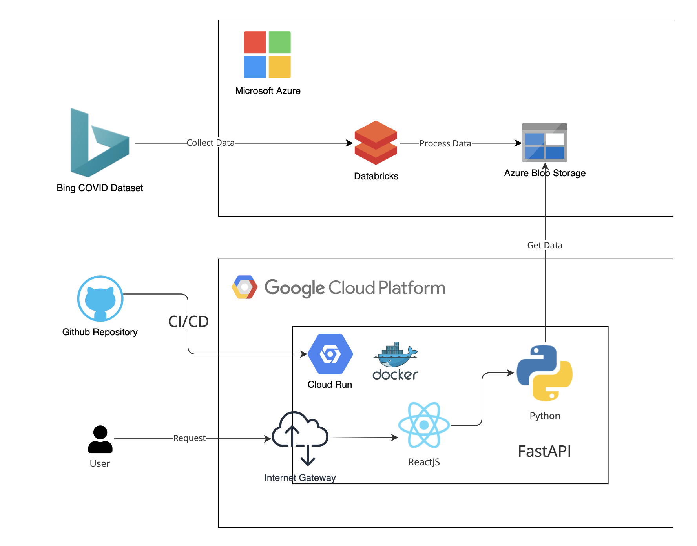

# Databricks COVID Visualizer
In this project, We utilized Databricks to process the COVID dataset. A Spark job has been set up to process the data periodically to generate a dashboard to show the daily COVID cases.

Demo link: https://covid.tinchun.top/

For the data processing code, you can check out [COVID.sql](./COVID.sql) for more detail.

We used Databricks REST API to retrieve the processed data on DBFS. We also configured a GCP Cloud Run CI/CD workflow to automate the development and deployment process.

# Architecture Diagram
